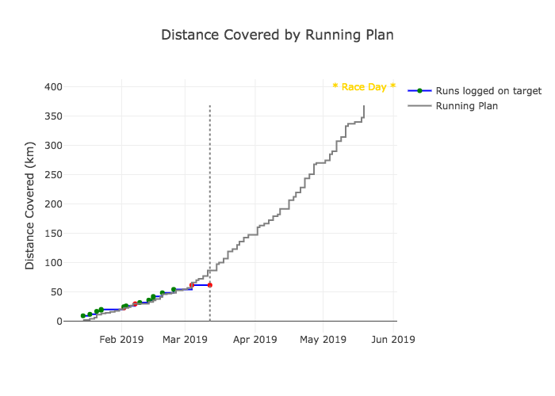
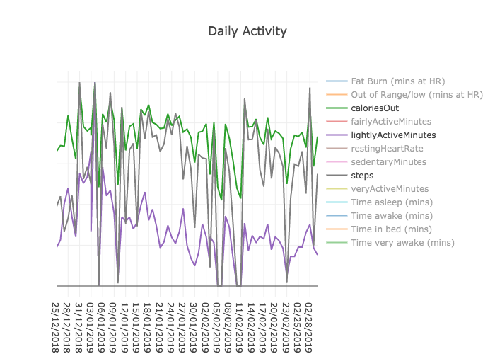

Fitbit Analysis
===============

This repository contains scripts to access [Fitbit](https://www.fitbit.com/uk/home) data from the API and analyse to determine changes in health and performance. Specifically, I wanted to track improvements in my running as I am training for a half marathon.

This analysis was inspired by:
-  [Brad Pitcher's python-fitbit repo](https://github.com/orcasgit/python-fitbit) which accessed the Fitbit API Python Client Implemented
- data analysis inspired by [Stephen Hsu's analysis](https://towardsdatascience.com/collect-your-own-fitbit-data-with-python-ff145fa10873) and [code here](https://github.com/stephenjhsu/fitbit/blob/master/Fitbit%20Exploration.ipynb)
- as well as [Matt's Gamification of fitbit](https://towardsdatascience.com/the-gamification-of-fitbit-how-an-api-provided-the-next-level-of-training-eaf7b267af00).

This analysis is mostly visualised using plotly, however since github does not include plotly interactive features I have simply included static pngs to display results. 

------------------------------------------------------------------------

### Outline

The repository is split into 3 parts:

1. `1_data_collection.ipynb` : Accesses the fitbit API and writes data to csvs.

2. `2_exercise_progress.ipynb`: This script looks at a running plan to track progress and  improvements over time.

- Specifically, it looks at the user's running log compared to a running plan. 

3. `3_general_analysis.ipynb` : Looks at the daily activity of the user and their sleep pattern. Generates a number of plots: 

- The user's daily activity. Plots a number of variables over time.

- Correlations of these variables. 

- Compares sleep logs to the desired full 8 hours.

## Automation

I have automated the script to replot the data every other day using [launchd](https://medium.com/@chetcorcos/a-simple-launchd-tutorial-9fecfcf2dbb3). 

------------------------------------------------------------------------

### Requirements

The codes are written in python so you will need:
- python 3
- fitbit account
- your fitbit api keys

Python Packages:
- fitbit : accesses the API, available [here](https://github.com/orcasgit/python-fitbit). Also forked into this repo API_access.
- pandas : for dataframe analysis
- os : for listing files etc.
- datetime : to organise dates
- cherrypy : used in the API access stage
- sys : for organising files
- gather_keys_oauth2 : for authorisation

#### Input files:

- api_key.csv : In a csv of format 

  | Heder         | Row           |
  | ------------- |:-------------:| 
  | client_id     | client_secret | 

- Running_Plan.csv : a csv of your running plan by distance covered. I created mine using the [nike run app](https://www.nike.com/gb/en_gb/c/nike-plus/running-app-gps). 

